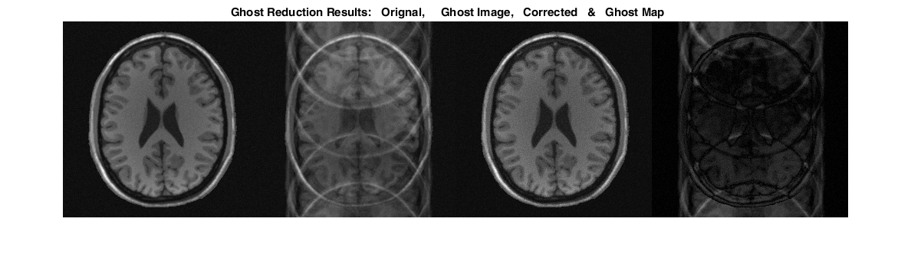

# sCPU
**Introduction**

This is a demo on how to use sCPU(Sensitivities Constrained Phase Update (sCPU) for Ghost Artifacts Reduction) for ghost artifacts reduction.
Using coil sensitivities as constraints, a synthetic image can be generated in which the ghost is reduced due to phase cancelation. Phase error was first estimated from the raw image and the synthetic image, 
and then was used to update the phase of raw k-space. The simulated ghost images with linear, random phase error or both random magnitude/phase error can be effiecntly corrected after several iterations.

**How to run the demo** ?

Just run the main.m !
Several paramters can be adjust for simulation differet type of ghost and different correction method. Such as sim_groups for ghost type & iter for iteration num.

**An example **

% input parameters
sim_groups =1; % 1: linear phase error  2: random phase error 3: random phase error & random magnitude error
iter = 10; % iteration num

%     -method                       :1, phase correction using combined phase error of all channels
%                                            2, phase correction using indivdual coil phase error
method = 1;

**Simulated Ghost Images and Correction Result**

**Estimated Phase error at the end of last iteration **

**Image at the end of each iteration** 

**RMSE at the end of each iteration **

